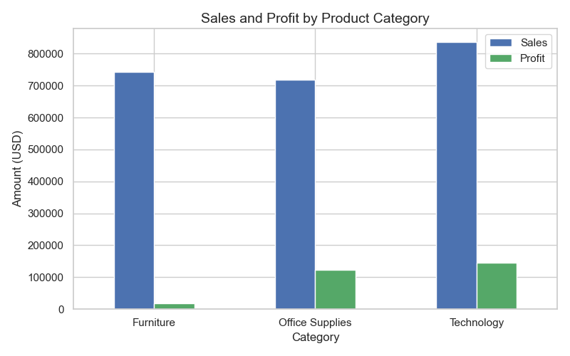
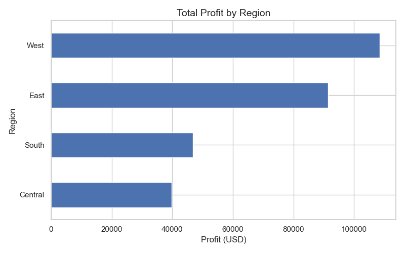
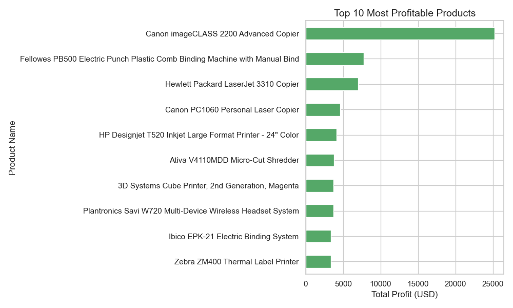
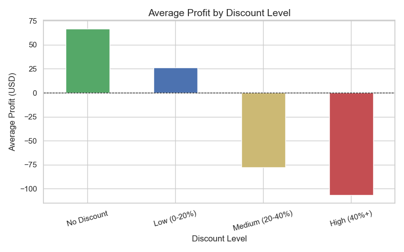
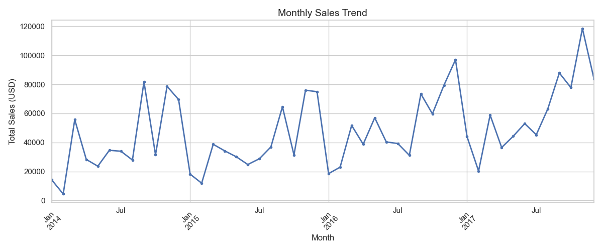

# 🛒 Retail Superstore — Sales & Profit Analysis

A complete end-to-end **Python Data Analysis project** on the Sample Superstore dataset.
Built using `pandas`, `numpy`, `matplotlib`, and `seaborn`.

---

## 📊 Live Report

👉 **[View Full Interactive Report](https://dhammadeepramteke30.github.io/retail-sales-analysis/)**

---

## 📁 Project Structure

```
retail_analysis/
│
├── data/
│   └── Sample - Superstore.csv       # Raw dataset (9,994 records)
│
├── notebooks/
│   └── retail_analysis.ipynb         # Full analysis notebook
│
├── outputs/
│   ├── chart1_category.png           # Sales & Profit by Category
│   ├── chart2_region.png             # Profit by Region
│   ├── chart3_top_products.png       # Top 10 Products
│   ├── chart4_discount.png           # Discount Impact on Profit
│   ├── chart5_monthly_trend.png      # Monthly Sales Trend (2014–2017)
│   ├── final_report.txt              # Text summary report
│   └── retail_report.html            # Interactive HTML report website
│
├── .gitignore                        # Files excluded from Git
├── requirements.txt                  # Python dependencies
└── README.md                         # This file
```

---

## 🔍 Key Findings

| # | Finding |
|---|---------|
| 1 | **Technology** is the most profitable category ($145K profit on $836K sales) |
| 2 | **Furniture** barely breaks even — only 2.5% profit margin on $742K sales |
| 3 | **West region** leads in both sales ($725K) and profit ($108K) |
| 4 | Discounts above **40% cause average losses of $107 per order** |
| 5 | Sales **peak every November** — Q4 surge is consistent across all years |

---

## 📈 Charts Preview

### Sales & Profit by Category


### Profit by Region


### Top 10 Most Profitable Products


### Discount Impact on Profit


### Monthly Sales Trend (2014–2017)


---

## 🚀 How to Run This Project

### 1. Clone the repository
```bash
git clone https://github.com/DHAMMADEEPRAMTEKE30/retail-sales-analysis.git
cd retail-sales-analysis
```

### 2. Install dependencies
```bash
pip install -r requirements.txt
```

### 3. Launch the notebook
```bash
jupyter notebook notebooks/retail_analysis.ipynb
```

### 4. View the HTML report
Open `outputs/retail_report.html` in any browser — no internet needed.

---

## 🛠 Tools & Libraries

| Tool | Purpose |
|------|---------|
| `pandas` | Data loading, cleaning, and analysis |
| `numpy` | Numerical operations |
| `matplotlib` | Chart and graph creation |
| `seaborn` | Statistical visualizations |
| `jupyter` | Interactive notebook environment |

---

## 📊 Business Summary

| Metric | Value |
|--------|-------|
| Total Revenue | $2,297,200.86 |
| Total Profit | $286,397.02 |
| Profit Margin | 12.47% |
| Total Orders | 5,009 |
| Total Customers | 793 |
| Best Region | West |
| Best Category | Technology |
| Worst Category | Furniture |

---

## 📌 Recommendations

1. **Cap all discounts at 20%** — discounts above 20% generate losses on every order
2. **Invest in Technology** — highest revenue and highest profit category
3. **Fix Furniture pricing** — $742K in sales but only $18K profit (2.5% margin)
4. **Focus expansion in West region** — leads in both sales and profit
5. **Prepare for Q4 demand surge** — stock up on top products by September every year

---

## 📂 Dataset

- **Name:** Sample Superstore
- **Source:** [Kaggle — Superstore Dataset](https://www.kaggle.com/datasets/vivek468/superstore-dataset-final)
- **Records:** 9,994 rows × 21 columns
- **Period:** 2014 – 2017
- **Region:** United States

---

*Analysis by **DHAMMADEEPRAMTEKE30** | Built with Python*
